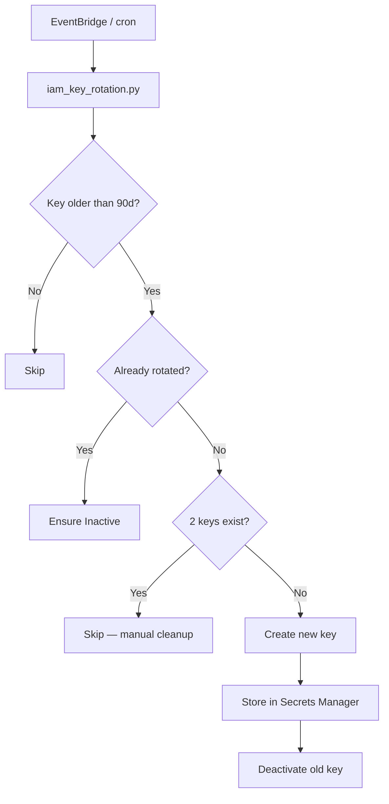

# IAM Access Key Rotator

Detects AWS IAM access keys older than 90 days, rotates them, and stores the new credentials in Secrets Manager.

---

## Requirements

- Python 3.8+
- `boto3` — `pip install boto3`
- AWS credentials configured (env vars, `~/.aws/credentials`, or an IAM role)

---

## Usage

```bash
# Scan only — no changes made
python iam_key_rotation.py --dry-run

# Rotate all stale keys (default: 90-day threshold)
python iam_key_rotation.py

# Custom threshold
python iam_key_rotation.py --max-age-days 60
```

---

## What it does

1. **Lists all IAM users** and their access keys (paginated — handles accounts with 100+ users)
2. **Flags keys** that are `Active` and older than the threshold
3. **Skips already-rotated keys** — if Secrets Manager already holds a different key for this user, it just ensures the old key is `Inactive`
4. **Rotates stale keys:**
   - Creates a new IAM access key
   - Stores it in Secrets Manager at `iam/<username>` (overwrites on re-run — no secret sprawl)
   - Deactivates the old key (kept for audit trail — delete manually when ready)
5. **Skips users with 2 existing keys** — AWS hard limit; manual cleanup required before rotation

---

## Where credentials are stored

One secret per user, overwritten on each rotation:

```
iam/<username>
```

Secret value (JSON):

```json
{
  "username": "alice",
  "access_key_id": "AKIA...",
  "secret_access_key": "...",
  "replaced_key_id": "AKIA_OLD...",
  "rotated_at": "2025-06-13T10:00:00+00:00"
}
```

---

## IAM permissions required

```json
{
  "Effect": "Allow",
  "Action": [
    "iam:ListUsers",
    "iam:ListAccessKeys",
    "iam:CreateAccessKey",
    "iam:UpdateAccessKey",
    "secretsmanager:GetSecretValue",
    "secretsmanager:PutSecretValue",
    "secretsmanager:CreateSecret"
  ],
  "Resource": "*"
}
```

---

## Idempotency

Safe to run multiple times. `already_rotated()` reads the secret at `iam/<username>` and checks whether the stored `access_key_id` differs from the stale key — if so, rotation already happened and it's skipped. The secret path is fixed per user, so re-runs overwrite rather than accumulate.

---



## Scheduling

Run daily via cron:

```
0 6 * * * python /opt/scripts/iam_key_rotation.py >> /var/log/iam-rotation.log 2>&1
```

Or deploy as a Lambda function triggered by an EventBridge rule (`rate(1 day)`).